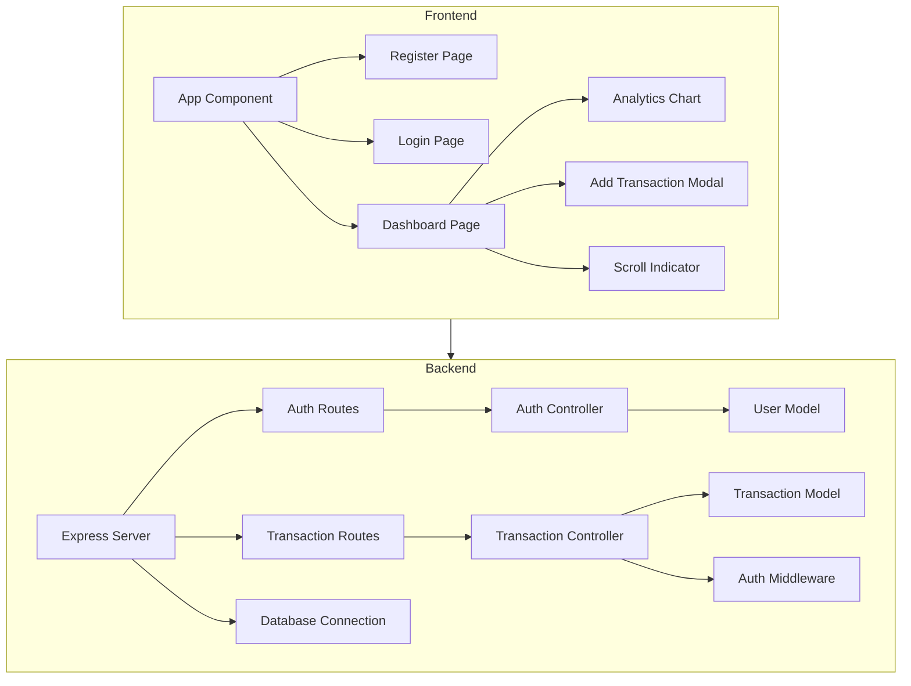

    

    <b>Automatic Architecture Diagrams from Code</b> 
    <a href="https://github.com/JashanMaan28/swark-continued">GitHub (Fork)</a> • <a href="https://github.com/swark-io/swark">Original Project</a>

## Usage Instructions

1. **Render the Diagram**: Use the links below to open it in Mermaid Live Editor, or install the [Mermaid Support](https://marketplace.visualstudio.com/items?itemName=bierner.markdown-mermaid) extension.
2. **Recommended Model**: If available for you, use `gemini` [language model](vscode://settings/swark-continued.languageModel). It can process more files and generates better diagrams.
3. **Iterate for Best Results**: Language models are non-deterministic. Generate the diagram multiple times and choose the best result.

## Generated Content
**Model**: GPT-4o - [Change Model](vscode://settings/swark-continued.languageModel)  
**Mermaid Live Editor**: [View](https://mermaid.live/view#pako:eNqNVMtugzAQ_BXL5-YHcqiUhFaq1EhVkp4ghw3eAKqxkW3aRlH-vcYkxjzSFgm06x0Pnp2FM00lQzqnicgUVDnZRYkg9tL1oV14VlIYFKxdbq5FVcX2JitZVlKgMPuutsGs0AZVfAvIG2QYAF5lVojYPYelCHR-kKBY7KMhZCGAn0yR6thHZJWDCo-wYGynQGhITSFFbFMS5GQtGfAAvk2V5PxFsCIFI1Xc5sQv7HvCyWz26EWOK07XeNnrmRDrAF7NXUBP1D3UQEsLc94NTF1C-tHzdIvq07r29F0p1PqahtJrk29kbdB23oakjQNAcLorLmz6CN6QrOxgNee173WcXT7NG-BD7slt7xqVdRp53ETEhdOsLWowIT1wtLQDaeAAGpuXCXSwALAuGOP4BQpbIV2-H3a4NdM3c7I8auWUDZ6ok_-LGUPeqU19MrfDd_EPP4b0_97TdWqyE9FyNMK335Gr-zGmD7REVULB7K_snFCTY4kJnZOEMjxCzU1CLxZUVwwMRgXYz6Ckc6NqfKBQG7k9ifSWK1lnOZ0fgWu8_ACILalI) | [Edit](https://mermaid.live/edit#pako:eNqNVMtugzAQ_BXL5-YHcqiUhFaq1EhVkp4ghw3eAKqxkW3aRlH-vcYkxjzSFgm06x0Pnp2FM00lQzqnicgUVDnZRYkg9tL1oV14VlIYFKxdbq5FVcX2JitZVlKgMPuutsGs0AZVfAvIG2QYAF5lVojYPYelCHR-kKBY7KMhZCGAn0yR6thHZJWDCo-wYGynQGhITSFFbFMS5GQtGfAAvk2V5PxFsCIFI1Xc5sQv7HvCyWz26EWOK07XeNnrmRDrAF7NXUBP1D3UQEsLc94NTF1C-tHzdIvq07r29F0p1PqahtJrk29kbdB23oakjQNAcLorLmz6CN6QrOxgNee173WcXT7NG-BD7slt7xqVdRp53ETEhdOsLWowIT1wtLQDaeAAGpuXCXSwALAuGOP4BQpbIV2-H3a4NdM3c7I8auWUDZ6ok_-LGUPeqU19MrfDd_EPP4b0_97TdWqyE9FyNMK335Gr-zGmD7REVULB7K_snFCTY4kJnZOEMjxCzU1CLxZUVwwMRgXYz6Ckc6NqfKBQG7k9ifSWK1lnOZ0fgWu8_ACILalI)

